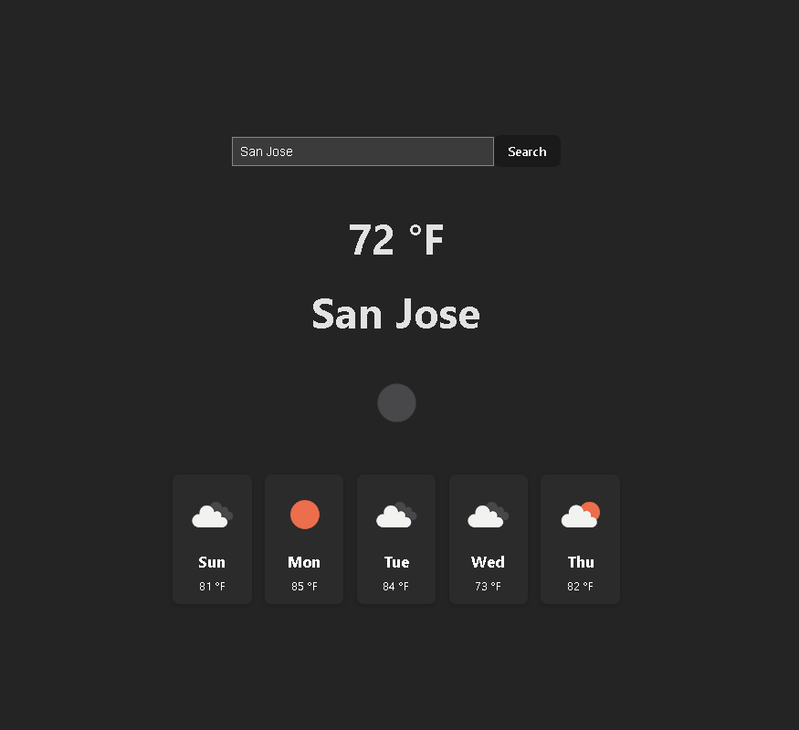

# Weather Dashboard

A small React + Vite weather dashboard that uses OpenWeather's APIs to show current conditions and a 5-day forecast for a searched city.

This repo is a compact, portfolio-ready demo demonstrating: simple React state management, API integration, defensive JSON parsing, and responsive UI components.

---

## Live preview
WIP

---

## Screenshot



---

## Features
- Search by city name (debounced input)
- Displays current temperature + icon
- 5-day forecast with icons and short descriptions
- Defensive handling of API response shapes
- Responsive layout with simple animations

---

## Tech
- React (18)
- Vite
- Fetch API (browser)
- OpenWeather One Call & Geocoding APIs

---

## Requirements
You need Node.js (recommend v16+) and an OpenWeather API key.

Create a `.env` file at the project root with the following variable:

```
VITE_WEATHER_API_KEY=your_openweather_api_key_here
```

(You can obtain a free API key at https://openweathermap.org/.)

---

## Run locally (PowerShell)
Open a PowerShell terminal in the project root and run:

```powershell
npm install
npm run dev
```

- The Vite dev server will print a local URL (typically `http://localhost:5173`).
- If you change `.env`, restart the dev server so Vite picks up the new env vars.

---

## Deploy
- Push this repository to GitHub.
- Connect the repo to Vercel or Netlify and set the environment variable `VITE_WEATHER_API_KEY` in the project settings.
- Build command: `npm run build` (Vite will use `vite build` by default).

---

## Future improvements planned
- Replace index-based React keys with a stable `dt` timestamp from the API for forecast list items.
- Add a unit toggle (°F/°C) and persist the preference in `localStorage`.
- Add basic tests for the normalization/network functions and a CI workflow (GitHub Actions) to run them.
- Consider swapping to TypeScript for stronger types in the services layer.

---

## License
MIT

---